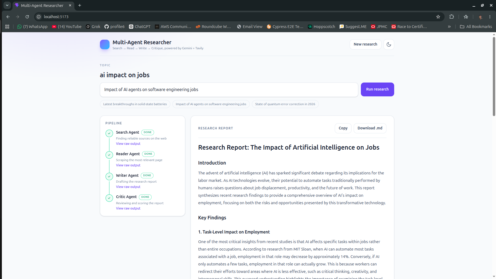
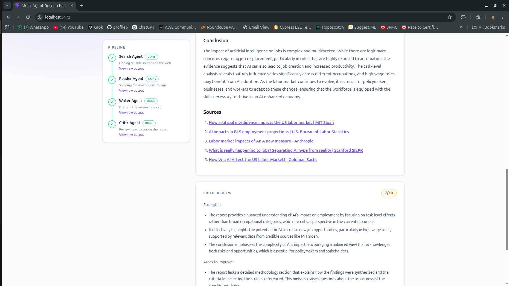

# Multi-Agent Research Backend

> An AI-powered research pipeline that searches the web, reads the most relevant source, writes a structured report, and evaluates the result with a dedicated critic agent.

[](https://www.python.org/)
[](https://www.langchain.com/)
[](https://platform.openai.com/)
[](https://tavily.com/)

## Live Demo

Try the deployed application here:

**[Open Multi-Agent Research Assistant →](https://multi-agent-research-frontend.bhoitepushpak6.workers.dev)**

The frontend provides a simple interface for submitting a research topic and viewing the generated research output.

## Related Repository

This repository contains the research pipeline and backend logic. The user interface is maintained separately:

- **Frontend:** [multi-agent-research-frontend](https://github.com/Pushpak-bhoite/multi-agent-research-frontend)
- **Backend:** [multi-agent-research-backend](https://github.com/Pushpak-bhoite/multi-agent-research-backend) *(this repository)*

## Overview

Multi-Agent Research Backend is the intelligence layer behind a research assistant application. Instead of asking one model to complete every task, the project separates the workflow into focused stages:

1. **Search Agent** – uses Tavily to find recent and relevant sources.
2. **Reader Agent** – selects a promising result and extracts readable page content.
3. **Writer Chain** – turns the gathered material into a professional report.
4. **Critic Chain** – reviews the report, scores it, highlights strengths, and suggests improvements.

This design demonstrates practical LLM application patterns including tool calling, agent specialization, prompt composition, web retrieval, source-aware generation, and automated output evaluation.

## Pipeline

```text
Research topic
      │
      ▼
Search Agent (Tavily)
      │
      ▼
Reader Agent (HTTPX + BeautifulSoup)
      │
      ▼
Writer Chain (GPT-4o-mini)
      │
      ▼
Critic Chain (GPT-4o-mini)
      │
      ▼
Research report + feedback
```

## Screenshots

### Research assistant interface



### Generated research workflow



## Key Features

- Multi-agent research workflow with specialized responsibilities
- AI-powered web search through Tavily
- Web-page retrieval and clean text extraction with HTTPX and BeautifulSoup
- Structured reports containing an introduction, key findings, conclusion, and sources
- Separate critic pass with a consistent score-and-feedback format
- Source URLs preserved as part of the research context
- Input validation for supported `http` and `https` URLs
- Content-length protection to keep scraped context manageable
- Environment-based secret management with `python-dotenv`

## Tech Stack

- **Python**
- **LangChain** for agents, prompts, and output parsing
- **LangGraph** for multi-agent workflow foundations
- **OpenAI GPT-4o-mini** as the language model
- **Tavily** for web search
- **HTTPX** for HTTP requests
- **BeautifulSoup** for HTML parsing and readable content extraction
- **Rich** for improved terminal output

## Project Structure

```text
.
├── agents.py         # Search/reader agents plus writer and critic chains
├── pipeline.py       # End-to-end research pipeline
├── tools.py          # Tavily search and web-page scraping tools
├── requirements.txt  # Pinned Python dependencies
├── public/
│   ├── image1.png    # Project screenshot
│   └── image2.png    # Project screenshot
├── app.py            # Application entry point reserved for API integration
├── cmd.txt           # Useful project commands
├── gitsetup.txt      # Git setup notes
└── notes.txt         # Architecture and implementation notes
```

## Getting Started

### 1. Clone the repository

```bash
git clone https://github.com/Pushpak-bhoite/multi-agent-research-backend.git
cd multi-agent-research-backend
```

### 2. Create and activate a virtual environment

```bash
python -m venv .venv

# macOS/Linux
source .venv/bin/activate

# Windows PowerShell
.venv\Scripts\Activate.ps1
```

### 3. Install dependencies

```bash
pip install -r requirements.txt
```

### 4. Configure environment variables

Create a `.env` file in the project root:

```env
OPENAI_API_KEY=your_openai_api_key
TAVILY_API_KEY=your_tavily_api_key
```

Get credentials from [OpenAI Platform](https://platform.openai.com/) and [Tavily](https://app.tavily.com/). Never commit your `.env` file or expose API keys in frontend code.

### 5. Run the pipeline

```bash
python pipeline.py
```

Enter a research topic when prompted. The pipeline will search for sources, scrape a relevant page, generate a report, and print the critic's evaluation.

## Example Prompt

```text
What are the latest developments in renewable energy storage?
```

The generated report is designed to include:

- Introduction
- At least three explained key findings
- Conclusion
- Source URLs
- Critic score, strengths, areas to improve, and a verdict

## Engineering Highlights

### Specialized agent design

Each stage has a clear responsibility, making the workflow easier to reason about, extend, and debug than a single monolithic prompt.

### Retrieval before generation

The writer receives search results and scraped source content, helping ground the report in current external information rather than relying only on model memory.

### Quality feedback loop

The critic chain provides a second-pass evaluation so research output can be inspected for clarity, completeness, and factual quality.

### Defensive scraping

The scraper validates URL schemes, follows redirects, handles HTTP/request errors, removes non-content HTML elements, and truncates extracted text to a safe maximum size.

## Roadmap

- Expose the pipeline through a production FastAPI API
- Add asynchronous research execution and progress updates
- Support multiple sources instead of one selected page
- Add citation verification and stronger fact-checking
- Add automated tests for agents, tools, and pipeline failure cases
- Add persistent research history and export options

## Security Notes

- Keep `OPENAI_API_KEY` and `TAVILY_API_KEY` private.
- Use `.env` only for local development and configure secrets through the deployment platform in production.
- Treat scraped web content as untrusted input.
- Review generated reports before using them for high-stakes decisions.

## Author

Built by **Pushpak Bhoite** as an exploration of multi-agent systems, retrieval-augmented generation, and practical AI research workflows.

- GitHub: [@Pushpak-bhoite](https://github.com/Pushpak-bhoite)
- Live demo: [multi-agent-research-frontend.bhoitepushpak6.workers.dev](https://multi-agent-research-frontend.bhoitepushpak6.workers.dev)

## License

No license has been specified yet. Add a `LICENSE` file if you want to define terms for using, modifying, and distributing this project.
